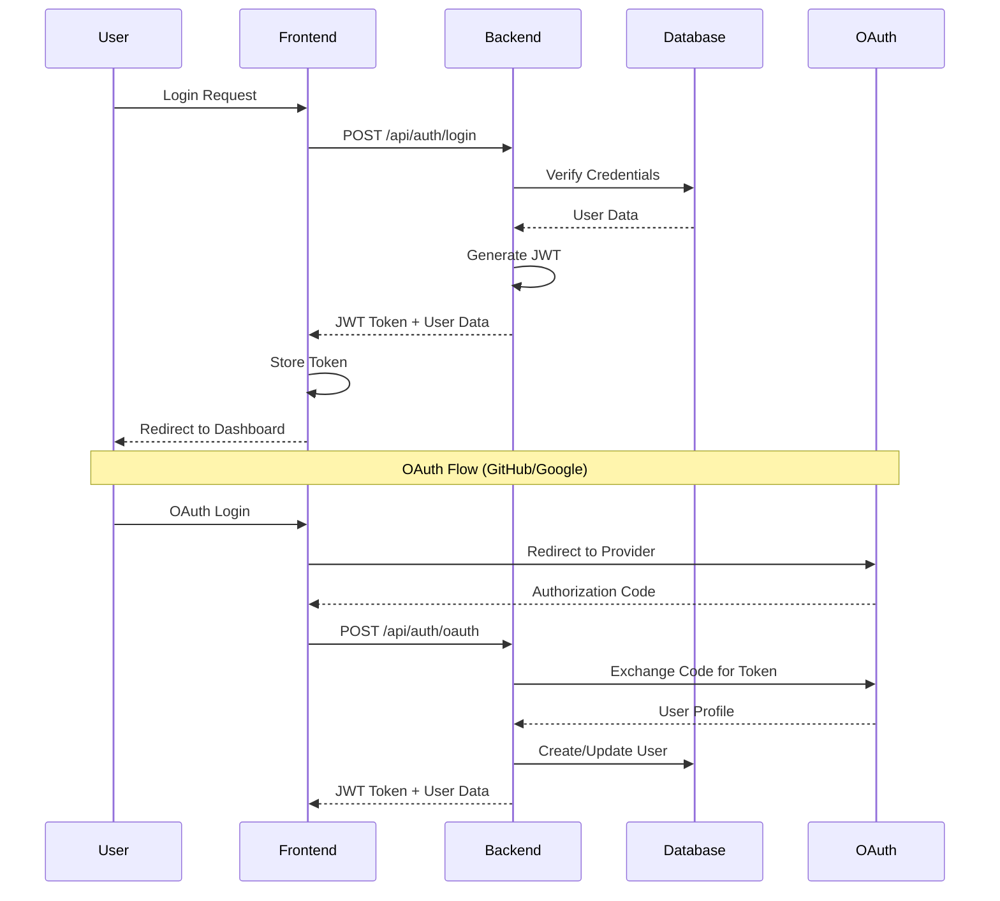
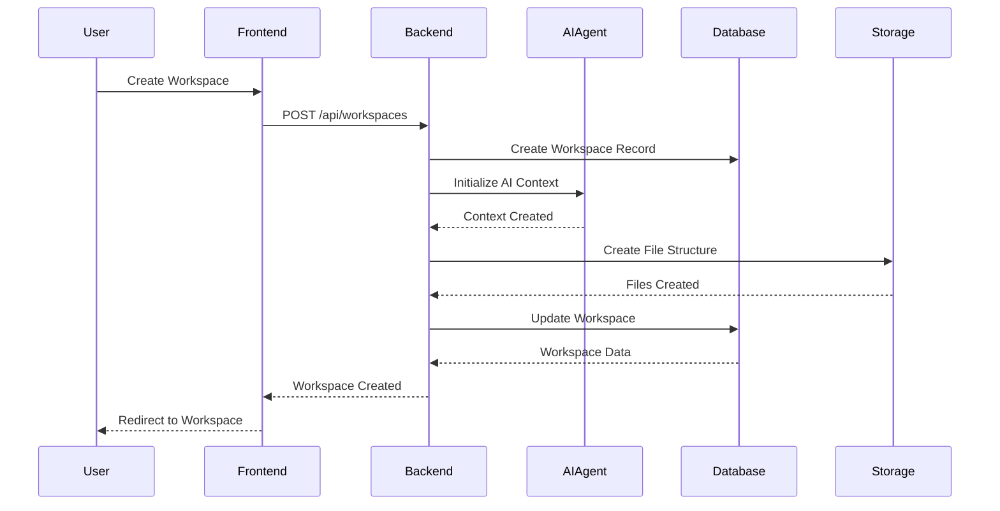
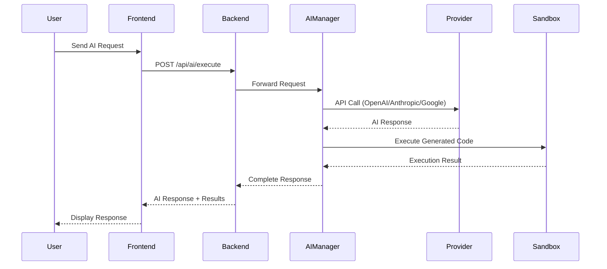
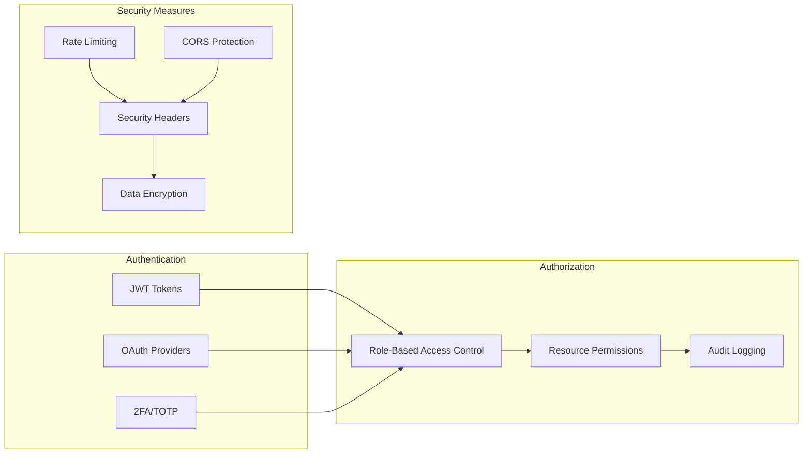
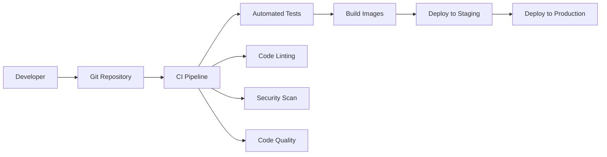

# Vibecode Clone - System Architecture

## Overview

Vibecode Clone is a comprehensive AI-powered development platform that provides real-time collaboration, deployment automation, and advanced monitoring capabilities. The system follows a microservices architecture with clear separation of concerns.

## System Architecture Diagram

```mermaid
graph TB
    subgraph "Client Layer"
        WEB[Web Browser]
        MOBILE[Mobile App]
    end

    subgraph "Load Balancer"
        NGINX[Nginx Reverse Proxy]
    end

    subgraph "Frontend Services"
        NEXT[Next.js Frontend]
        STATIC[Static Assets]
    end

    subgraph "API Gateway"
        GATEWAY[API Gateway]
    end

    subgraph "Core Services"
        BACKEND[Backend API<br/>Node.js + Fastify]
        AGENTS[AI Agent Manager<br/>Node.js + Fastify]
        COLLAB[Collaboration Service<br/>WebSocket + Socket.IO]
    end

    subgraph "AI Providers"
        OPENAI[OpenAI<br/>GPT-4]
        ANTHROPIC[Anthropic<br/>Claude]
        GOOGLE[Google AI<br/>Gemini]
        CUSTOM[Custom Agents]
    end

    subgraph "Data Layer"
        POSTGRES[(PostgreSQL<br/>Primary Database)]
        REDIS[(Redis<br/>Cache & Sessions)]
    end

    subgraph "Storage"
        S3[AWS S3<br/>File Storage]
        SUPABASE[Supabase<br/>Alternative Storage]
    end

    subgraph "Execution Environment"
        DOCKER[Docker Containers<br/>Sandbox Execution]
        K8S[Kubernetes<br/>Container Orchestration]
    end

    subgraph "Deployment Services"
        VERCEL[Vercel]
        NETLIFY[Netlify]
        FLYIO[Fly.io]
        CUSTOM_DEPLOY[Custom Deployment]
    end

    subgraph "Monitoring & Observability"
        PROMETHEUS[Prometheus<br/>Metrics Collection]
        GRAFANA[Grafana<br/>Dashboards]
        LOGS[Centralized Logging]
    end

    subgraph "External Integrations"
        GITHUB[GitHub API]
        STRIPE[Stripe Payments]
        SMTP[Email Service]
    end

    %% Client connections
    WEB --> NGINX
    MOBILE --> NGINX

    %% Load balancer routing
    NGINX --> NEXT
    NGINX --> GATEWAY

    %% Frontend connections
    NEXT --> STATIC
    NEXT --> GATEWAY

    %% API Gateway routing
    GATEWAY --> BACKEND
    GATEWAY --> AGENTS
    GATEWAY --> COLLAB

    %% Core service connections
    BACKEND --> POSTGRES
    BACKEND --> REDIS
    BACKEND --> S3
    BACKEND --> SUPABASE
    BACKEND --> DOCKER
    BACKEND --> GITHUB
    BACKEND --> STRIPE
    BACKEND --> SMTP

    AGENTS --> OPENAI
    AGENTS --> ANTHROPIC
    AGENTS --> GOOGLE
    AGENTS --> CUSTOM
    AGENTS --> REDIS
    AGENTS --> DOCKER

    COLLAB --> REDIS
    COLLAB --> POSTGRES

    %% Deployment connections
    BACKEND --> VERCEL
    BACKEND --> NETLIFY
    BACKEND --> FLYIO
    BACKEND --> CUSTOM_DEPLOY

    %% Monitoring connections
    BACKEND --> PROMETHEUS
    AGENTS --> PROMETHEUS
    COLLAB --> PROMETHEUS
    PROMETHEUS --> GRAFANA

    %% Container orchestration
    DOCKER --> K8S

    %% Styling
    classDef frontend fill:#e1f5fe
    classDef backend fill:#f3e5f5
    classDef data fill:#e8f5e8
    classDef external fill:#fff3e0
    classDef monitoring fill:#fce4ec

    class NEXT,STATIC frontend
    class BACKEND,AGENTS,COLLAB backend
    class POSTGRES,REDIS,S3,SUPABASE data
    class GITHUB,STRIPE,SMTP,VERCEL,NETLIFY,FLYIO external
    class PROMETHEUS,GRAFANA,LOGS monitoring
```

## Component Overview

### Frontend Layer
- **Next.js Application**: Server-side rendered React application with TypeScript
- **Static Assets**: CDN-served static resources (images, fonts, etc.)
- **Mobile Support**: Responsive design with PWA capabilities

### API Layer
- **API Gateway**: Request routing, authentication, and rate limiting
- **Backend API**: Core business logic, data management, and integrations
- **AI Agent Manager**: AI provider abstraction and request orchestration
- **Collaboration Service**: Real-time features using WebSocket connections

### Data Layer
- **PostgreSQL**: Primary relational database for structured data
- **Redis**: Caching, session storage, and real-time data
- **File Storage**: AWS S3 or Supabase for user files and assets

### Execution Environment
- **Docker Containers**: Isolated sandbox environments for code execution
- **Kubernetes**: Container orchestration and scaling (production)

## Data Flow Diagrams

### User Authentication Flow

### Workspace Creation Flow

### AI Agent Execution Flow

## Security Architecture

### Authentication & Authorization

### Sandbox Security

- **Container Isolation**: Each execution runs in isolated Docker containers
- **Resource Limits**: CPU, memory, and disk usage restrictions
- **Network Restrictions**: No external network access by default
- **File System Isolation**: Sandboxed file system with limited access
- **Time Limits**: Execution timeout to prevent infinite loops

## Scalability Considerations

### Horizontal Scaling
- **Stateless Services**: All services designed to be stateless for easy scaling
- **Load Balancing**: Nginx for request distribution
- **Container Orchestration**: Kubernetes for automated scaling
- **Database Sharding**: Planned for high-volume scenarios

### Caching Strategy
- **Redis Caching**: Frequently accessed data and session storage
- **CDN**: Static assets served via CDN
- **Database Query Optimization**: Indexed queries and connection pooling

### Performance Optimization
- **Async Processing**: Background jobs for heavy operations
- **Connection Pooling**: Database and external service connections
- **Compression**: Response compression for API calls
- **Lazy Loading**: Frontend components and data

## Monitoring & Observability

### Metrics Collection
- **Application Metrics**: Request rates, response times, error rates
- **System Metrics**: CPU, memory, disk usage
- **Business Metrics**: User activity, feature usage, revenue

### Logging Strategy
- **Structured Logging**: JSON-formatted logs with correlation IDs
- **Centralized Logging**: All services log to central location
- **Log Levels**: Debug, info, warn, error, fatal
- **Log Retention**: Configurable retention policies

### Alerting
- **Threshold Alerts**: CPU, memory, disk usage
- **Error Rate Alerts**: Application and system errors
- **Business Alerts**: Payment failures, user signup issues
- **Health Check Alerts**: Service availability

## Disaster Recovery

### Backup Strategy
- **Database Backups**: Daily automated backups with point-in-time recovery
- **File Storage Backups**: Replicated across multiple regions
- **Configuration Backups**: Infrastructure as code versioning

### Recovery Procedures
- **RTO (Recovery Time Objective)**: 4 hours for full system recovery
- **RPO (Recovery Point Objective)**: 15 minutes maximum data loss
- **Failover**: Automated failover for critical services
- **Testing**: Regular disaster recovery testing

## Deployment Architecture

### Environments
- **Development**: Local development with Docker Compose
- **Staging**: Production-like environment for testing
- **Production**: Multi-region deployment with high availability

### CI/CD Pipeline

## Technology Stack Summary

| Component | Technology | Purpose |
|-----------|------------|---------|
| Frontend | Next.js 14, React 18, TypeScript | User interface and client-side logic |
| Backend API | Node.js, Fastify, TypeScript | Core business logic and API endpoints |
| AI Manager | Node.js, Fastify, TypeScript | AI provider abstraction and orchestration |
| Database | PostgreSQL 15 | Primary data storage |
| Cache | Redis 7 | Session storage and caching |
| File Storage | AWS S3, Supabase | User files and static assets |
| Containers | Docker, Kubernetes | Sandboxed code execution |
| Monitoring | Prometheus, Grafana | Metrics and observability |
| Deployment | Vercel, Netlify, Fly.io | Application hosting |
| Auth | NextAuth.js, JWT | Authentication and authorization |
| Real-time | Socket.IO, WebSocket | Live collaboration features |

## Future Enhancements

### Planned Features
- **GraphQL API**: Alternative to REST for better client flexibility
- **Microservices**: Further service decomposition for better scalability
- **Event Sourcing**: Event-driven architecture for better audit trails
- **Machine Learning**: Custom AI models for code suggestions
- **Mobile Apps**: Native iOS and Android applications

### Infrastructure Improvements
- **Multi-region**: Global deployment for better performance
- **Edge Computing**: CDN with edge functions
- **Serverless**: Migration to serverless architecture where appropriate
- **AI/ML Pipeline**: Automated model training and deployment