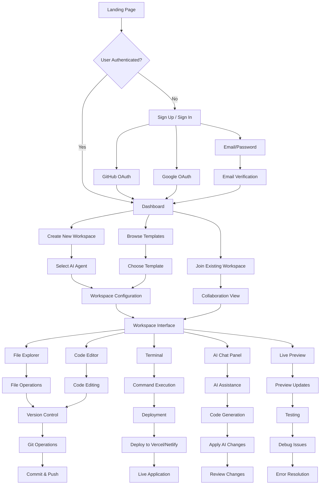
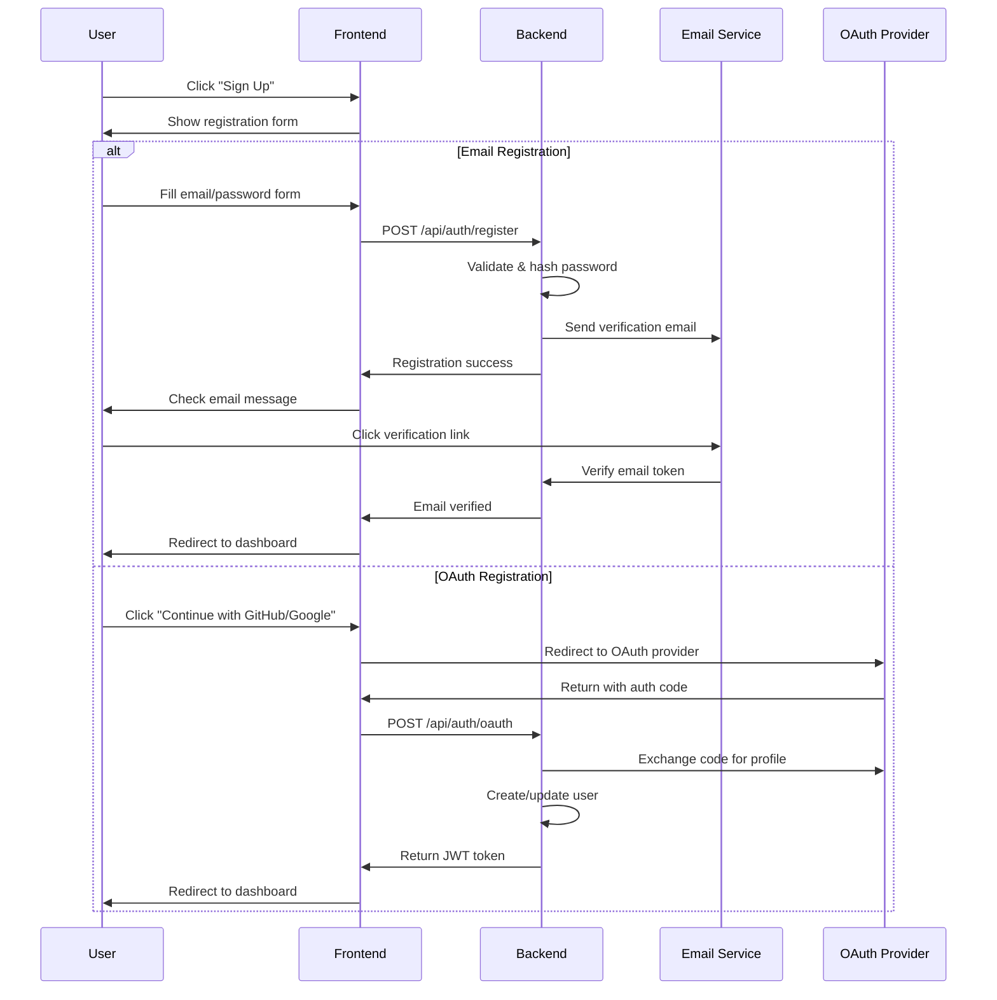
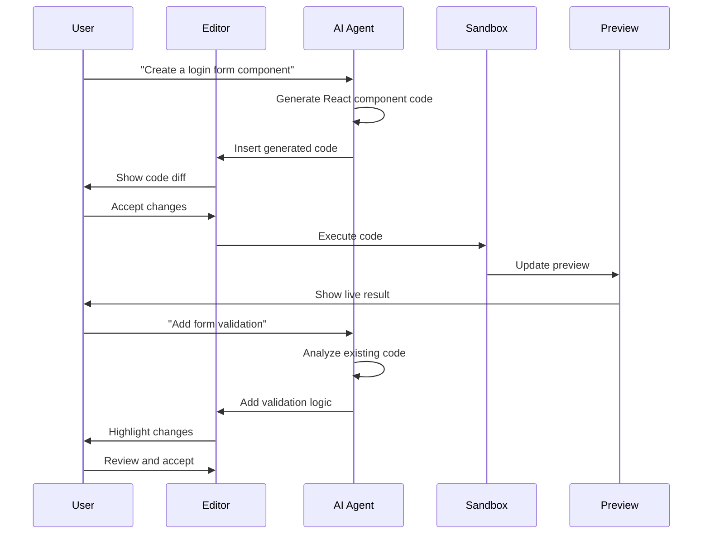
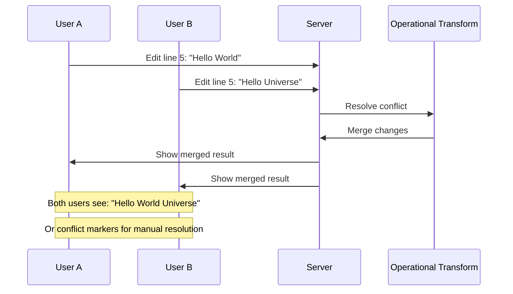
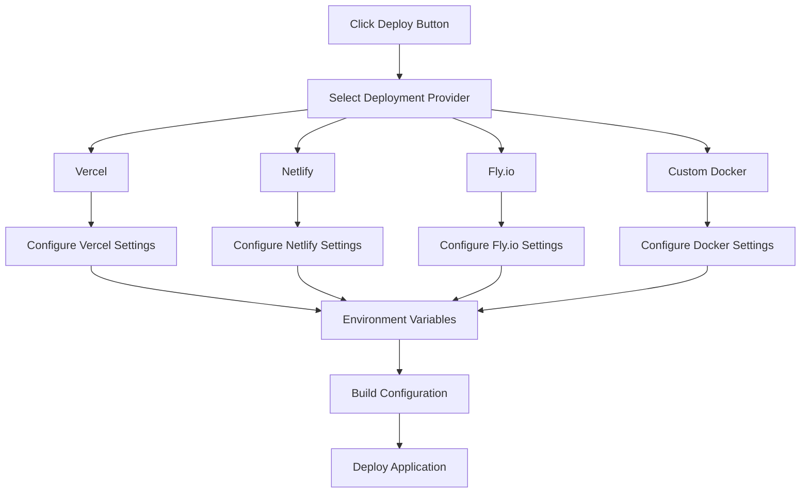
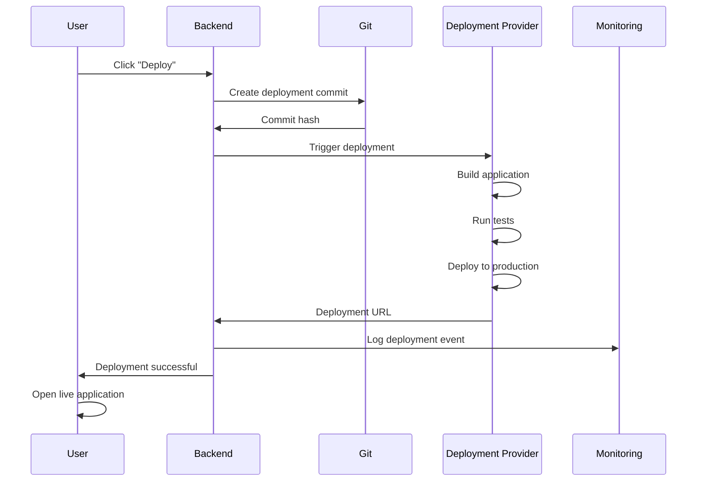

# Vibecode Clone - User Flow Documentation

## Overview

This document outlines the complete user journey through the Vibecode Clone platform, from initial registration to advanced collaboration features.

## User Flow Diagram



## Detailed User Journeys

### 1. New User Onboarding

#### Step 1: Landing Page
- User visits the Vibecode Clone homepage
- Sees feature overview, pricing, and testimonials
- Clear call-to-action buttons: "Get Started" and "View Demo"

#### Step 2: Registration


#### Step 3: Profile Setup
- User completes profile information
- Chooses subscription tier (Free/Pro/Team)
- Sets up 2FA (optional but recommended)

### 2. Workspace Creation Flow

#### Step 1: Dashboard Overview
- User sees existing workspaces
- Quick actions: Create New, Browse Templates, Join Workspace
- Recent activity and collaboration invites

#### Step 2: Workspace Creation
```mermaid
graph TD
    A[Click "Create New Workspace"] --> B[Choose Creation Method]
    B --> C[From Scratch]
    B --> D[From Template]
    B --> E[Import from GitHub]
    
    C --> F[Select AI Agent]
    D --> G[Browse Template Library]
    E --> H[Connect GitHub Account]
    
    F --> I[Workspace Configuration]
    G --> J[Template Preview]
    H --> K[Repository Selection]
    
    I --> L[Create Workspace]
    J --> M[Use Template]
    K --> N[Import Repository]
    
    M --> I
    N --> I
    L --> O[Workspace Interface]
```

#### Step 3: AI Agent Selection
- **Claude Code**: For advanced code generation and debugging
- **GPT-5 Codex**: For general-purpose development assistance  
- **Gemini CLI**: For command-line and system administration tasks
- **Custom Agent**: User-configured AI with specific capabilities

#### Step 4: Workspace Configuration
- Project name and description
- Programming language and framework
- Environment variables
- Collaboration settings
- Deployment preferences

### 3. Development Workflow

#### Step 1: Workspace Interface
```
┌─────────────────────────────────────────────────────────────┐
│ Vibecode Clone - My Project                    [⚙️] [👤] [🔔] │
├─────────────────────────────────────────────────────────────┤
│                                                             │
│ ┌─────────────┐ ┌─────────────────────────┐ ┌─────────────┐ │
│ │ File        │ │ Editor                  │ │ AI Assistant│ │
│ │ Explorer    │ │                         │ │             │ │
│ │             │ │  1  import React from   │ │ 💬 How can  │ │
│ │ 📁 src/     │ │     'react'             │ │    I help   │ │
│ │   📄 App.js │ │  2                      │ │    you?     │ │
│ │   📄 index  │ │  3  function App() {    │ │             │ │
│ │ 📁 public/  │ │  4    return (          │ │ [Send]      │ │
│ │   📄 index  │ │  5      <div>           │ │             │ │
│ │ 📄 package  │ │  6        Hello World   │ │ Recent:     │ │
│ │             │ │  7      </div>          │ │ • Generated │ │
│ │             │ │  8    )                 │ │   component │ │
│ │             │ │  9  }                   │ │ • Fixed bug │ │
│ │             │ │ 10                      │ │   in line 5 │ │
│ └─────────────┘ │ 11  export default App  │ └─────────────┘ │
│                 └─────────────────────────┘                 │
│ ┌─────────────────────────────────────────────────────────┐ │
│ │ Terminal                                    Live Preview│ │
│ │ $ npm start                                             │ │
│ │ Starting development server...                          │ │
│ │ Server running on http://localhost:3000                 │ │
│ │                                                         │ │
│ └─────────────────────────────────────────────────────────┘ │
└─────────────────────────────────────────────────────────────┘
```

#### Step 2: AI-Assisted Development


#### Step 3: File Operations
- **Create**: New files and folders via context menu or AI assistance
- **Edit**: Real-time code editing with syntax highlighting and IntelliSense
- **Delete**: Safe deletion with confirmation and recovery options
- **Rename**: Smart renaming with import/reference updates
- **Move**: Drag-and-drop with automatic path resolution

#### Step 4: Terminal Operations
- **Package Management**: npm/yarn/pip install commands
- **Build Scripts**: Run build, test, and development commands
- **Git Operations**: Commit, push, pull, branch management
- **Deployment**: One-click deployment commands

### 4. Collaboration Workflow

#### Step 1: Inviting Collaborators
```mermaid
graph TD
    A[Open Workspace Settings] --> B[Click "Invite Collaborators"]
    B --> C[Enter Email/Username]
    C --> D[Select Role]
    D --> E[Set Permissions]
    E --> F[Send Invitation]
    
    D --> D1[Viewer - Read Only]
    D --> D2[Editor - Read/Write]
    D --> D3[Admin - Full Access]
    
    F --> G[Email Notification]
    G --> H[Collaborator Joins]
    H --> I[Real-time Sync Active]
```

#### Step 2: Real-time Collaboration
- **Live Cursors**: See where other users are editing
- **Simultaneous Editing**: Operational Transform for conflict resolution
- **Chat Integration**: In-workspace messaging and comments
- **Presence Indicators**: Online/offline status of collaborators

#### Step 3: Conflict Resolution


### 5. Deployment Workflow

#### Step 1: Deployment Configuration


#### Step 2: Deployment Process


#### Step 3: Post-Deployment
- **Live URL**: Instant access to deployed application
- **Monitoring**: Performance metrics and error tracking
- **Rollback**: Easy rollback to previous versions
- **Custom Domains**: Connect custom domain names

### 6. Advanced Features

#### Template Creation
```mermaid
graph TD
    A[Create Successful Project] --> B[Click "Save as Template"]
    B --> C[Template Configuration]
    C --> D[Add Description & Tags]
    D --> E[Set Visibility]
    E --> F[Configure Template Variables]
    F --> G[Publish to Marketplace]
    
    E --> E1[Private - Personal Use]
    E --> E2[Team - Organization Only]
    E --> E3[Public - Community Access]
```

#### Plugin System
- **ESLint Integration**: Code quality and style checking
- **Prettier**: Automatic code formatting
- **Jest/Cypress**: Testing framework integration
- **Custom Plugins**: User-developed extensions

#### Monitoring Dashboard
- **Performance Metrics**: Response times, error rates, uptime
- **User Analytics**: Active users, feature usage, retention
- **Resource Usage**: CPU, memory, storage consumption
- **Cost Tracking**: Infrastructure and service costs

## User Experience Considerations

### Accessibility
- **Keyboard Navigation**: Full keyboard accessibility
- **Screen Readers**: ARIA labels and semantic HTML
- **High Contrast**: Theme options for visual impairments
- **Font Scaling**: Adjustable font sizes

### Performance
- **Lazy Loading**: Components and data loaded on demand
- **Code Splitting**: Optimized bundle sizes
- **Caching**: Aggressive caching for better performance
- **Offline Support**: PWA capabilities for offline work

### Mobile Experience
- **Responsive Design**: Optimized for all screen sizes
- **Touch Interactions**: Mobile-friendly controls
- **Progressive Web App**: Installable mobile experience
- **Offline Sync**: Work offline, sync when connected

## Error Handling & Recovery

### Common Error Scenarios
1. **Network Connectivity Issues**
   - Auto-retry failed requests
   - Offline mode with local storage
   - Clear error messages and recovery steps

2. **Authentication Failures**
   - Automatic token refresh
   - Graceful logout and re-authentication
   - Session persistence across browser restarts

3. **Deployment Failures**
   - Detailed error logs and diagnostics
   - Rollback to previous working version
   - Support contact for complex issues

4. **Collaboration Conflicts**
   - Automatic conflict resolution where possible
   - Manual merge tools for complex conflicts
   - Version history for recovery

### User Support
- **Help Documentation**: Comprehensive guides and tutorials
- **In-App Help**: Contextual help and tooltips
- **Community Forum**: User community for questions and tips
- **Support Tickets**: Direct support for technical issues

This user flow documentation provides a comprehensive overview of how users interact with the Vibecode Clone platform, from initial registration through advanced development workflows.